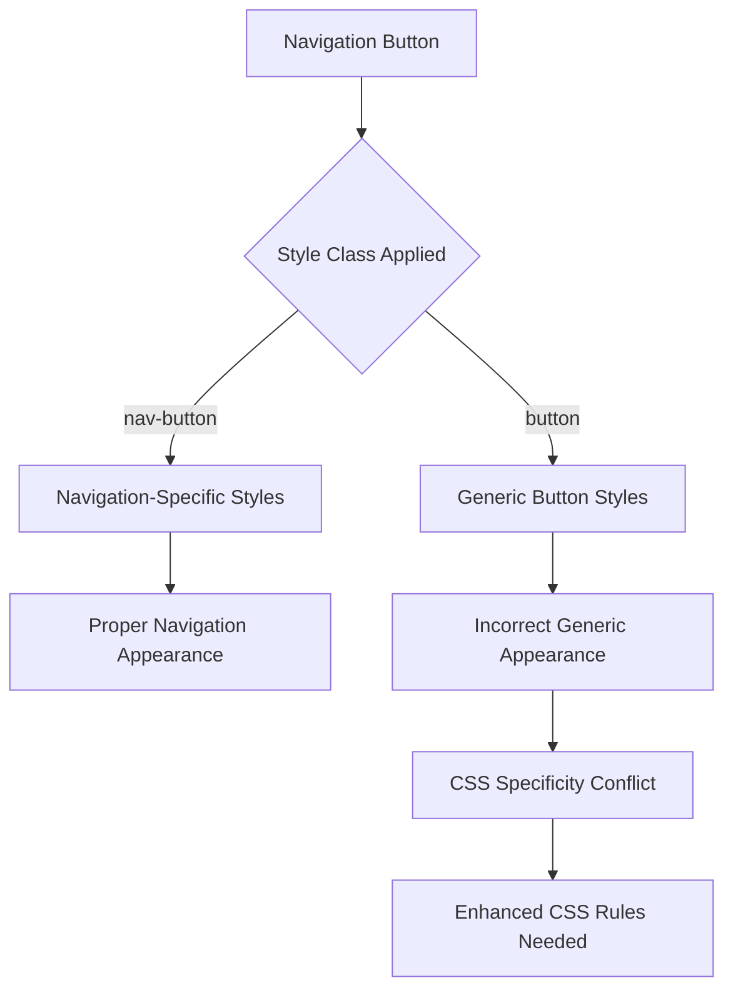

# Navigation Button Styling Enhancement Design

## Overview

This design addresses the need to enhance navigation button styling in the ERP System's sidebar by implementing comprehensive button state management and ensuring proper CSS specificity to prevent style conflicts between generic buttons and navigation buttons.

## Current System Analysis

### Existing Navigation Button Structure

The current system uses dedicated `.nav-button` styling classes in both theme files:

**Dark Theme Navigation Button States:**
- Default: Transparent background with `#9ca3af` text
- Hover: Green accent with `rgba(46, 160, 67, 0.15)` background and `#7ee787` text  
- Pressed: Blue accent with `rgba(88, 166, 255, 0.2)` background and `#79c0ff` text
- Active: Primary blue `#0969da` background with white text

**Light Theme Navigation Button States:**
- Default: Transparent background with `#9ca3af` text
- Hover: Green accent with `rgba(34, 134, 58, 0.1)` background and `#bdbdbd` text
- Pressed: Blue accent with `rgba(9, 105, 218, 0.15)` background and `#0550ae` text  
- Active: Primary blue `#0969da` background with white text

### Style Conflict Issue

The problem occurs when navigation buttons inherit generic `.button` styles instead of using their dedicated `.nav-button` styles. This happens due to CSS specificity conflicts where generic button rules override navigation-specific rules.

## Architecture Enhancement

### CSS Specificity Strategy



### Enhanced Navigation Button System

The solution involves strengthening CSS specificity for navigation buttons and ensuring proper class application in FXML:

1. **CSS Rule Specificity Enhancement**: Increase specificity of `.nav-button` rules to override any generic button inheritance
2. **Style Class Management**: Ensure navigation buttons use only `nav-button` class, not generic `button` class
3. **State Management**: Implement comprehensive button state handling for all interaction scenarios

## Technical Implementation

### CSS Enhancement Strategy

#### Dark Theme Navigation Button Rules

```css
/* Enhanced navigation button specificity */
.sidebar .nav-button {
    -fx-background-color: transparent;
    -fx-text-fill: #7d8590;
    -fx-font-size: 15px;
    -fx-font-weight: 500;
    -fx-padding: 16 24;
    -fx-alignment: center-left;
    -fx-border-width: 0;
    -fx-cursor: hand;
    -fx-background-radius: 6;
    -fx-margin: 0 8 4 8;
}

.sidebar .nav-button:hover {
    -fx-background-color: rgba(46, 160, 67, 0.15);
    -fx-text-fill: #7ee787;
    -fx-background-radius: 6;
}

.sidebar .nav-button:pressed {
    -fx-background-color: rgba(88, 166, 255, 0.2);
    -fx-text-fill: #79c0ff;
    -fx-background-radius: 6;
}

.sidebar .nav-button.active {
    -fx-background-color: #0969da;
    -fx-text-fill: #ffffff;
    -fx-background-radius: 6;
    -fx-border-width: 0;
}
```

#### Light Theme Navigation Button Rules

```css
.sidebar .nav-button {
    -fx-background-color: transparent;
    -fx-text-fill: #7c8b9a;
    -fx-font-size: 15px;
    -fx-font-weight: 500;
    -fx-padding: 16 24;
    -fx-alignment: center-left;
    -fx-border-width: 0;
    -fx-cursor: hand;
    -fx-background-radius: 6;
    -fx-margin: 0 8 4 8;
}

.sidebar .nav-button:hover {
    -fx-background-color: rgba(34, 134, 58, 0.1);
    -fx-text-fill: #1a7f37;
    -fx-background-radius: 6;
}

.sidebar .nav-button:pressed {
    -fx-background-color: rgba(9, 105, 218, 0.15);
    -fx-text-fill: #0550ae;
    -fx-background-radius: 6;
}

.sidebar .nav-button.active {
    -fx-background-color: #0969da;
    -fx-text-fill: #ffffff;
    -fx-background-radius: 6;
    -fx-border-width: 0;
}
```

### FXML Structure Verification

The current FXML structure correctly applies `nav-button` class:

```xml
<Button fx:id="dashboardBtn" alignment="CENTER_LEFT" maxWidth="1.7976931348623157E308" 
        onAction="#showDashboard" text="📊 Dashboard" 
        styleClass="nav-button,active" />

<Button fx:id="suppliersBtn" alignment="CENTER_LEFT" maxWidth="1.7976931348623157E308" 
        onAction="#showSuppliers" text="🏢 Suppliers" 
        styleClass="nav-button" />
```

## Component State Management

### Navigation Button States

| State | Description | Visual Characteristics |
|-------|-------------|----------------------|
| **Default** | Normal resting state | Subtle text color, transparent background |
| **Hover** | Mouse over interaction | Green accent background and text |
| **Pressed** | Mouse down interaction | Blue accent background and text |
| **Active** | Current page indicator | Solid blue background, white text |
| **Focused** | Keyboard navigation | Blue border and background tint |

### State Transition Flow

```mermaid
stateDiagram-v2
    [*] --> Default
    Default --> Hover : mouse_enter
    Hover --> Default : mouse_exit
    Hover --> Pressed : mouse_down
    Pressed --> Hover : mouse_up
    Default --> Active : page_navigation
    Hover --> Active : page_navigation
    Pressed --> Active : page_navigation
    Active --> Default : navigate_away
    Default --> Focused : keyboard_focus
    Focused --> Default : focus_lost
```

## Color Specification

### Dark Theme Color Palette

| State | Background | Text Color | Purpose |
|-------|------------|------------|---------|
| Default | `transparent` | `#7d8590` | Subtle integration with sidebar |
| Hover | `rgba(46, 160, 67, 0.15)` | `#7ee787` | Green accent for feedback |
| Pressed | `rgba(88, 166, 255, 0.2)` | `#79c0ff` | Blue accent for interaction |
| Active | `#0969da` | `#ffffff` | Clear current page indicator |

### Light Theme Color Palette

| State | Background | Text Color | Purpose |
|-------|------------|------------|---------|
| Default | `transparent` | `#7c8b9a` | Harmonious with light sidebar |
| Hover | `rgba(34, 134, 58, 0.1)` | `#1a7f37` | Green accent for feedback |
| Pressed | `rgba(9, 105, 218, 0.15)` | `#0550ae` | Blue accent for interaction |
| Active | `#0969da` | `#ffffff` | Consistent active state |

## Implementation Strategy

### Phase 1: CSS Specificity Enhancement

1. **Update Dark Theme CSS**
   - Enhance `.nav-button` selectors with `.sidebar` prefix
   - Adjust default text colors for better integration
   - Ensure proper state transitions

2. **Update Light Theme CSS**
   - Apply corresponding enhancements to light theme
   - Maintain color harmony with existing palette
   - Test cross-theme consistency

### Phase 2: FXML Validation

1. **Verify Style Class Application**
   - Ensure all navigation buttons use `nav-button` class
   - Remove any generic `button` class references
   - Validate proper active state management

2. **Controller Integration**
   - Verify active state management in MainController
   - Ensure proper CSS class manipulation during navigation

### Phase 3: Testing and Validation

1. **Visual Testing**
   - Test all button states in both themes
   - Verify smooth transitions between states
   - Validate accessibility and readability

2. **Interaction Testing**
   - Test mouse hover/press interactions
   - Verify keyboard navigation behavior
   - Validate active state persistence

## Testing Strategy

### Visual State Testing

| Test Case | Expected Result |
|-----------|----------------|
| Default State | Navigation buttons display with subtle colors, well integrated with sidebar |
| Hover Interaction | Green accent appears on mouse hover with smooth transition |
| Press Interaction | Blue accent appears on mouse press |
| Active State | Current page button shows solid blue background with white text |
| Theme Switching | All states work correctly in both dark and light themes |

### Integration Testing

- Verify navigation functionality remains intact
- Test button state persistence during theme changes
- Validate proper CSS cascade and specificity
- Ensure no style conflicts with other button types

## Design Principles

### Visual Hierarchy

1. **Subtle Default State**: Navigation buttons should integrate harmoniously with sidebar background
2. **Clear Feedback**: Hover and press states provide immediate visual feedback
3. **Obvious Active State**: Current page is clearly identified with distinct styling
4. **Consistent Theming**: Both dark and light themes follow the same interaction patterns

### Accessibility Considerations

- Sufficient color contrast ratios for all text states
- Clear visual distinction between different button states
- Keyboard navigation support with visible focus indicators
- Consistent interaction patterns across the application

### Performance Optimization

- Minimal CSS rule complexity to ensure smooth transitions
- Efficient selector specificity to avoid style calculation overhead
- Consistent margin and padding to maintain layout stability