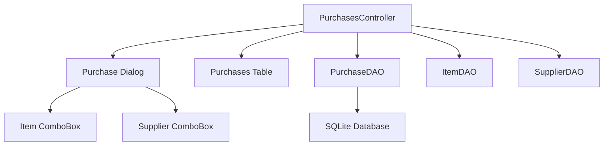
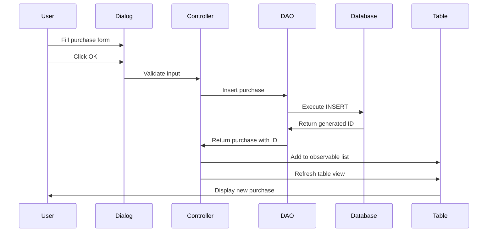
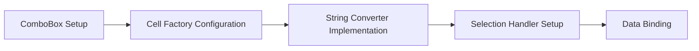
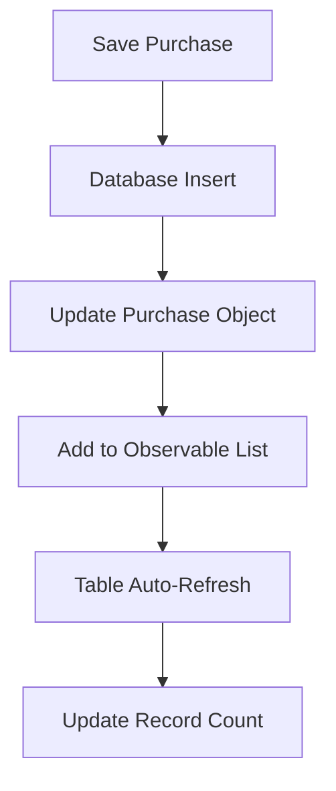
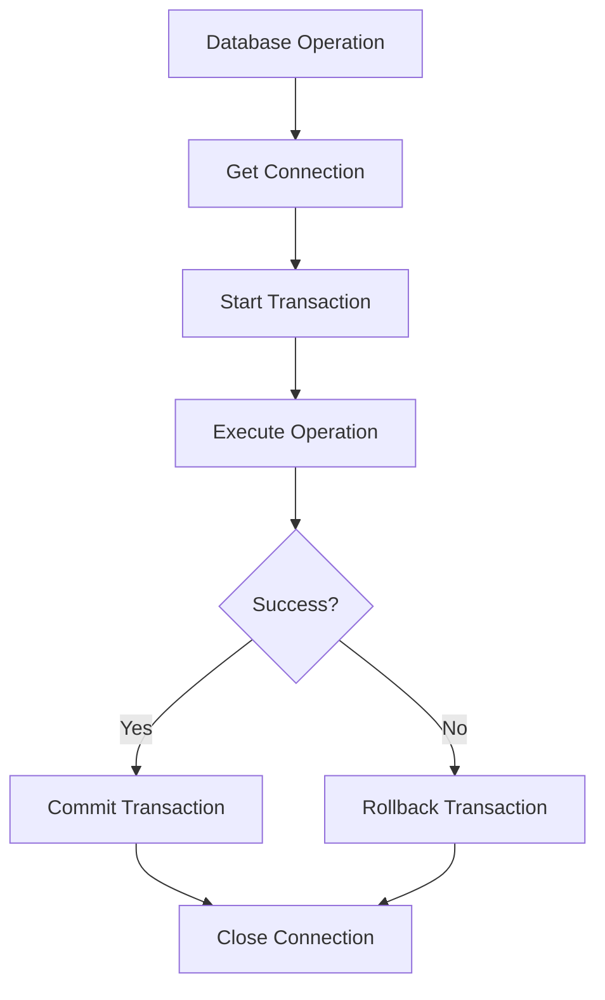
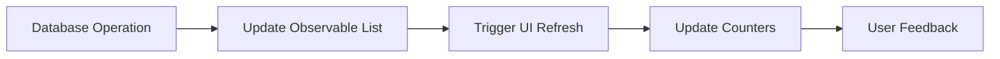

# Purchase UI Fix Design Document

## Overview

This document outlines the fixes required for the purchasing module UI issues, specifically addressing the supplier dropdown functionality and purchase record addition problems in the ERP system.

## Current Issues Identified

### 1. Supplier Dropdown Display Issue
- ComboBox items not displaying properly in the add/edit purchase dialog
- Missing cell factory configuration for proper item rendering
- Selection mechanism not working correctly

### 2. Purchase Addition to Table Issue
- New purchases not immediately appearing in the table view
- Table refresh mechanism not working properly after adding purchases
- Data synchronization problems between dialog and table

### 3. Database Transaction Issues
- Potential connection management problems
- Transaction rollback scenarios not handled properly

## Architecture

### Component Overview

### Data Flow for Purchase Addition

## Fix Implementation Strategy

### 1. ComboBox Display Fix

#### Problem Analysis
The supplier and item ComboBoxes are not displaying items correctly because they lack proper cell factories and string converters.

#### Solution Design

#### Implementation Requirements
- Configure cell factory for proper item display
- Implement string converter for selection handling
- Ensure proper data binding with observable lists
- Add selection change listeners

### 2. Table Update Fix

#### Problem Analysis
After adding a purchase, the table is not updating properly due to missing refresh mechanisms and incorrect data synchronization.

#### Solution Design

#### Implementation Requirements
- Ensure purchase object is properly updated with generated ID
- Add purchase to observable list immediately after successful save
- Trigger table refresh explicitly
- Update record count display
- Handle error scenarios with proper rollback

### 3. Database Connection Enhancement

#### Connection Management Pattern

## UI Component Fixes

### ComboBox Configuration

#### Supplier ComboBox Setup
- Cell factory for displaying supplier names
- String converter for proper selection handling
- Prompt text configuration
- Event handling for selection changes

#### Item ComboBox Setup
- Cell factory for displaying item names with categories
- String converter implementation
- Search functionality integration
- Validation for required selection

### Dialog Enhancement

#### Form Validation Improvements
- Real-time validation feedback
- Clear error message display
- Field highlighting for invalid inputs
- Required field indicators

#### User Experience Enhancements
- Auto-calculation of total values
- Date picker default values
- Field focus management
- Keyboard navigation support

## Data Management Fixes

### Observable List Synchronization

#### Purchase List Management

#### Refresh Strategy
- Immediate local updates for add operations
- Background refresh for data consistency
- Error handling with proper user notification
- Optimistic UI updates with rollback capability

### Database Transaction Management

#### Transaction Scope Design
- Single transaction per operation
- Proper connection lifecycle management
- Error handling with appropriate rollback
- Resource cleanup in finally blocks

## Error Handling Strategy

### User Interface Errors
- Form validation with clear messages
- Network/database error notifications
- Operation status feedback
- Recovery action suggestions

### Database Errors
- Connection timeout handling
- Transaction rollback procedures
- Constraint violation messages
- Data integrity error reporting

## Validation Rules

### Purchase Form Validation
- Item selection: Required field
- Supplier selection: Required field
- Quantity: Positive integer required
- Purchase rate: Positive decimal required
- Date: Valid date required, not future date

### Business Logic Validation
- Supplier must exist in database
- Item must exist in database
- Purchase rate must be reasonable
- Quantity must be within acceptable limits

## Testing Strategy

### Unit Testing Requirements
- ComboBox selection functionality
- Form validation logic
- Database transaction handling
- Error scenario coverage

### Integration Testing
- Complete purchase workflow
- Database connection management
- UI component interaction
- Data synchronization verification

### User Acceptance Testing
- Purchase addition workflow
- Edit functionality verification
- Search and filter operations
- Error handling user experience