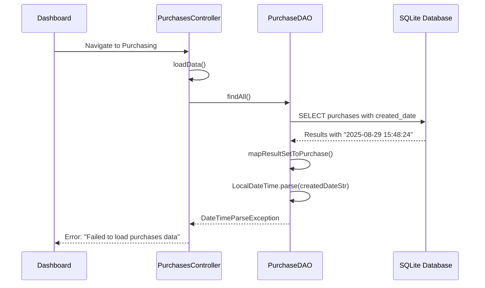
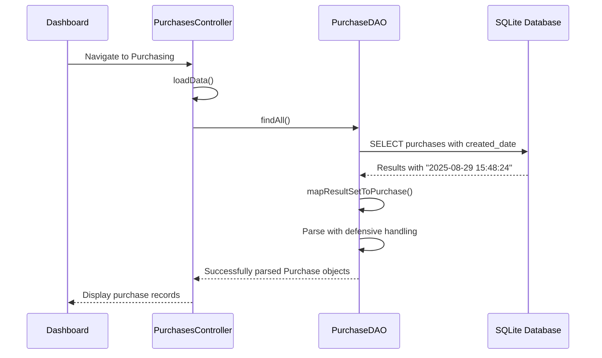

# Purchasing Module Error Fix Design

## Overview

This design document addresses the critical error occurring in the purchasing module when navigating from the dashboard. The error "Failed to load purchases data: Text '2025-08-29 15:48:24' could not be parsed at index 10" indicates a date parsing issue in the `PurchaseDAO.mapResultSetToPurchase()` method.

## Error Analysis

### Problem Identification
The error occurs when the application attempts to parse the `created_date` field from the SQLite database. The issue is in `PurchaseDAO.java` at line 299:

```java
purchase.setCreatedDate(LocalDateTime.parse(createdDateStr));
```

### Root Cause
- **SQLite Date Format**: `YYYY-MM-DD HH:MM:SS` (e.g., `2025-08-29 15:48:24`)
- **Java LocalDateTime.parse() Expected Format**: ISO-8601 with `T` separator (e.g., `2025-08-29T15:48:24`)
- **Parsing Failure Point**: Index 10 corresponds to the space character between date and time

### Impact
- Application crashes when navigating to purchasing module
- Prevents users from viewing, adding, or managing purchase records
- Blocks critical business operations

## Architecture

### Current Flow


### Proposed Solution Flow


## Data Models & Date Handling

### Database Schema
```sql
-- Current schema (SQLite format)
CREATE TABLE purchases (
    purchase_id INTEGER PRIMARY KEY AUTOINCREMENT,
    item_id INTEGER NOT NULL,
    quantity INTEGER NOT NULL,
    supplier_id INTEGER NOT NULL,
    purchase_rate DECIMAL(10,2) NOT NULL,
    total_value DECIMAL(10,2) NOT NULL,
    purchase_date DATE NOT NULL,
    created_date DATETIME DEFAULT CURRENT_TIMESTAMP
);
```

### Date Format Specifications
| Source | Format | Example |
|--------|--------|---------|
| SQLite DATETIME | `YYYY-MM-DD HH:MM:SS` | `2025-08-29 15:48:24` |
| Java LocalDateTime | ISO-8601 | `2025-08-29T15:48:24` |
| Required Conversion | Space → T | `2025-08-29 15:48:24` → `2025-08-29T15:48:24` |

## Business Logic Layer

### Enhanced Date Parsing Strategy

#### Primary Approach: Format-Aware Parsing
```java
// Defensive parsing with multiple format support
private LocalDateTime parseCreatedDate(String dateString) {
    if (dateString == null || dateString.trim().isEmpty()) {
        return LocalDateTime.now();
    }
    
    try {
        // Try ISO format first (with T separator)
        if (dateString.contains("T")) {
            return LocalDateTime.parse(dateString);
        }
        
        // Handle SQLite format (space separator)
        if (dateString.contains(" ")) {
            String isoFormat = dateString.replace(" ", "T");
            return LocalDateTime.parse(isoFormat);
        }
        
        // Fallback: try direct parsing
        return LocalDateTime.parse(dateString);
        
    } catch (DateTimeParseException e) {
        // Defensive fallback
        return LocalDateTime.now();
    }
}
```

#### Alternative Approach: Timestamp-Based Parsing
```java
// Using SQL Timestamp for reliable parsing
private LocalDateTime parseCreatedDateTimestamp(ResultSet rs, String columnName) throws SQLException {
    try {
        Timestamp timestamp = rs.getTimestamp(columnName);
        return timestamp != null ? timestamp.toLocalDateTime() : LocalDateTime.now();
    } catch (SQLException e) {
        return LocalDateTime.now();
    }
}
```

### Error Recovery Mechanism

#### Graceful Degradation Strategy
1. **Primary**: Parse date string with format conversion
2. **Secondary**: Use SQL Timestamp conversion
3. **Fallback**: Default to current timestamp
4. **Logging**: Record parsing failures for monitoring

#### Implementation Pattern
```mermaid
flowchart TD
    A[Receive created_date string] --> B{Is null/empty?}
    B -->|Yes| C[Return LocalDateTime.now()]
    B -->|No| D{Contains 'T'?}
    D -->|Yes| E[Parse as ISO format]
    D -->|No| F{Contains space?}
    F -->|Yes| G[Replace space with 'T']
    G --> H[Parse as ISO format]
    F -->|No| I[Try direct parse]
    E --> J{Parse successful?}
    H --> J
    I --> J
    J -->|Yes| K[Return parsed date]
    J -->|No| L[Log error & return current time]
```

## API Integration Layer

### DAO Layer Modifications

#### Updated mapResultSetToPurchase Method
```java
private Purchase mapResultSetToPurchase(ResultSet rs) throws SQLException {
    Purchase purchase = new Purchase();
    
    // Basic field mapping (unchanged)
    purchase.setPurchaseId(rs.getInt("purchase_id"));
    purchase.setItemId(rs.getInt("item_id"));
    purchase.setQuantity(rs.getInt("quantity"));
    purchase.setSupplierId(rs.getInt("supplier_id"));
    purchase.setPurchaseRate(rs.getBigDecimal("purchase_rate"));
    purchase.setTotalValue(rs.getBigDecimal("total_value"));
    purchase.setPurchaseDate(LocalDate.parse(rs.getString("purchase_date")));
    
    // Enhanced created_date parsing
    handleCreatedDateParsing(rs, purchase);
    
    // Display properties (unchanged)
    setDisplayProperties(rs, purchase);
    
    return purchase;
}
```

#### Error Handling Enhancement
```java
private void handleCreatedDateParsing(ResultSet rs, Purchase purchase) throws SQLException {
    try {
        // Primary method: Use Timestamp
        Timestamp createdTimestamp = rs.getTimestamp("created_date");
        if (createdTimestamp != null) {
            purchase.setCreatedDate(createdTimestamp.toLocalDateTime());
            return;
        }
        
        // Fallback method: String parsing with format conversion
        String createdDateStr = rs.getString("created_date");
        if (createdDateStr != null && !createdDateStr.trim().isEmpty()) {
            LocalDateTime parsedDate = parseCreatedDateString(createdDateStr);
            purchase.setCreatedDate(parsedDate);
        } else {
            purchase.setCreatedDate(LocalDateTime.now());
        }
        
    } catch (Exception e) {
        // Ultimate fallback
        purchase.setCreatedDate(LocalDateTime.now());
        // Optional: Log the error for monitoring
        System.err.println("Warning: Failed to parse created_date, using current time. Error: " + e.getMessage());
    }
}
```

## Middleware & Error Handling

### Controller-Level Error Handling

#### Enhanced Data Loading
```java
private void loadData() {
    Task<Void> loadTask = new Task<Void>() {
        @Override
        protected Void call() throws Exception {
            try {
                List<Purchase> purchases = purchaseDAO.findAll();
                List<Item> items = itemDAO.findAll();
                List<Supplier> suppliers = supplierDAO.findAll();
                
                Platform.runLater(() -> {
                    purchasesList.clear();
                    purchasesList.addAll(purchases);
                    itemsList.clear();
                    itemsList.addAll(items);
                    suppliersList.clear();
                    suppliersList.addAll(suppliers);
                    updateRecordCount();
                });
                
            } catch (Exception e) {
                // Enhanced error information
                Platform.runLater(() -> {
                    String errorMsg = "Database Error: " + e.getMessage();
                    if (e.getCause() != null) {
                        errorMsg += "\nCause: " + e.getCause().getMessage();
                    }
                    MainApplication.showErrorAlert("Failed to Load Data", errorMsg);
                });
                throw e;
            }
            
            return null;
        }
    };
    
    loadTask.setOnFailed(e -> {
        Throwable exception = loadTask.getException();
        Platform.runLater(() -> {
            MainApplication.showErrorAlert("Database Error", 
                "Failed to load purchases data: " + exception.getMessage());
        });
    });
    
    Thread loadThread = new Thread(loadTask);
    loadThread.setDaemon(true);
    loadThread.start();
}
```

### Validation & Input Handling

#### Date Consistency Validation
```java
// Ensure date handling consistency across operations
private boolean validateDateInputs(LocalDate purchaseDate) {
    if (purchaseDate == null) {
        validationLabel.setText("Purchase date is required");
        return false;
    }
    
    if (purchaseDate.isAfter(LocalDate.now())) {
        validationLabel.setText("Purchase date cannot be in the future");
        return false;
    }
    
    return true;
}
```

## Testing Strategy

### Unit Testing for Date Parsing

#### Test Cases for Date Handling
```java
@Test
public void testCreatedDateParsing() {
    // Test SQLite format
    String sqliteFormat = "2025-08-29 15:48:24";
    LocalDateTime result = parseCreatedDateString(sqliteFormat);
    assertEquals(LocalDateTime.of(2025, 8, 29, 15, 48, 24), result);
    
    // Test ISO format
    String isoFormat = "2025-08-29T15:48:24";
    result = parseCreatedDateString(isoFormat);
    assertEquals(LocalDateTime.of(2025, 8, 29, 15, 48, 24), result);
    
    // Test null/empty handling
    result = parseCreatedDateString(null);
    assertNotNull(result);
    
    // Test malformed date handling
    result = parseCreatedDateString("invalid-date");
    assertNotNull(result);
}
```

#### Integration Testing
```java
@Test
public void testPurchaseDataLoading() {
    // Test complete data loading flow
    PurchaseDAO dao = new PurchaseDAO();
    
    assertDoesNotThrow(() -> {
        List<Purchase> purchases = dao.findAll();
        assertNotNull(purchases);
        
        for (Purchase purchase : purchases) {
            assertNotNull(purchase.getCreatedDate());
            assertNotNull(purchase.getPurchaseDate());
        }
    });
}
```

### Error Scenario Testing

#### Test Database Edge Cases
| Test Case | Input | Expected Behavior |
|-----------|-------|------------------|
| Null created_date | `null` | Use current timestamp |
| Empty created_date | `""` | Use current timestamp |
| SQLite format | `"2025-08-29 15:48:24"` | Parse successfully |
| ISO format | `"2025-08-29T15:48:24"` | Parse successfully |
| Malformed date | `"invalid-date"` | Use current timestamp |
| Future date | Valid future date | Accept (business rule) |

## Implementation Plan

### Phase 1: Critical Fix
1. **Update PurchaseDAO.mapResultSetToPurchase()**
   - Implement defensive date parsing
   - Add timestamp-based fallback
   - Test with existing data

2. **Enhance Error Handling**
   - Improve error messages
   - Add logging for date parsing failures
   - Ensure graceful degradation

### Phase 2: Validation & Testing
1. **Add Unit Tests**
   - Date parsing test suite
   - Error handling validation
   - Integration testing

2. **Data Validation**
   - Verify all existing records parse correctly
   - Test with various date formats
   - Performance impact assessment

### Phase 3: Monitoring & Documentation
1. **Error Monitoring**
   - Add logging for date parsing issues
   - Monitor for recurring problems
   - Performance metrics

2. **Documentation Updates**
   - Update troubleshooting guide
   - Document date handling patterns
   - Code comments and examples

## Risk Assessment & Mitigation

### Potential Risks
| Risk | Impact | Probability | Mitigation |
|------|--------|-------------|------------|
| Data Loss | High | Low | Use timestamp conversion as primary method |
| Performance Impact | Medium | Low | Optimize parsing logic |
| Existing Data Corruption | High | Low | Validate before deployment |
| User Experience Degradation | Medium | Low | Comprehensive testing |

### Rollback Strategy
1. **Immediate Rollback**: Revert to previous DAO version
2. **Data Integrity Check**: Validate all purchase records
3. **Alternative Fix**: Use database migration if needed
4. **User Communication**: Notify users of temporary limitations

## Deployment Considerations

### Pre-Deployment Checklist
- [ ] Backup current database
- [ ] Test with production data sample
- [ ] Validate all date parsing scenarios
- [ ] Performance testing completed
- [ ] Error handling verified

### Post-Deployment Monitoring
- Monitor application logs for date parsing errors
- Track user navigation success rates
- Validate data integrity
- Collect user feedback on purchasing module functionality