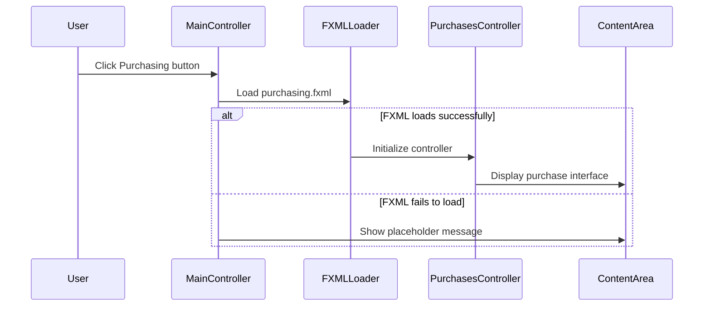
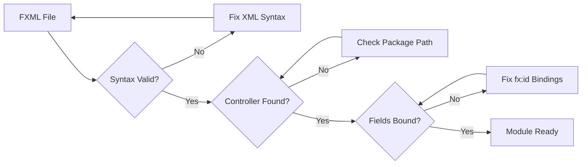

# Purchasing Module Issue Fix

## Overview
The ERP System's purchasing module is displaying "purchasing view under development" instead of loading the proper functional interface. While other modules (suppliers, customers, items) work correctly, the purchasing module fails to load its complete FXML interface despite having a fully implemented `PurchasesController.java` and `purchasing.fxml` file.

## Repository Type
**Backend Application** - JavaFX desktop application with MVC architecture using FXML for UI, DAO pattern for data access, and SQLite database.

## Root Cause Analysis

### Issue Identification
```mermaid
flowchart TD
    A[User clicks Purchasing in sidebar] --> B[MainController.showPurchasing()]
    B --> C[loadView('/fxml/purchasing.fxml')]
    C --> D{FXML Loading}
    D -->|Success| E[Load PurchasesController]
    D -->|Failure| F[Show Placeholder: 'under development']
    E --> G[Initialize purchasing interface]
    F --> H[Display static message only]
    
    style F fill:#ffcccc
    style H fill:#ffcccc
```

### Current State vs Expected State

| Component | Current State | Expected State | Status |
|-----------|---------------|----------------|--------|
| purchasing.fxml | ✅ Complete (63 lines) | Functional UI layout | Present |
| PurchasesController.java | ✅ Complete (567 lines) | Full implementation | Present |
| MainController navigation | ⚠️ Error handling | Load purchasing.fxml | Needs fix |
| Database schema | ✅ Complete | Purchases table ready | Working |
| DAO layer | ✅ Complete | PurchaseDAO implemented | Working |

## Architecture Analysis

### Current Navigation Flow


### Module Comparison Analysis

#### Working Modules (Suppliers, Customers, Items)
- ✅ Complete FXML files with proper controller bindings
- ✅ Fully implemented controller classes
- ✅ Successful navigation from MainController
- ✅ Proper error handling and initialization

#### Purchasing Module Issue
- ✅ Complete FXML file exists (`purchasing.fxml`)
- ✅ Complete controller exists (`PurchasesController.java`)
- ❌ Navigation fails to load the view properly
- ❌ Falls back to placeholder message

## Technical Specifications

### FXML Structure Analysis
The `purchasing.fxml` file contains:
- Proper controller binding: `fx:controller="com.erpsystem.controller.PurchasesController"`
- Complete UI elements with fx:id bindings
- Event handler mappings (`onAction`, `onKeyReleased`)
- TableView with all required columns
- Toolbar with CRUD operation buttons

### Controller Implementation
The `PurchasesController` includes:
- Proper FXML annotations for all UI components
- Complete initialization method with table setup
- Full CRUD operations (add, edit, delete, search)
- Dialog-based data entry forms
- Database integration through DAO layer

### MainController Loading Mechanism
```java
private boolean loadView(String fxmlPath, String viewName) {
    try {
        FXMLLoader loader = new FXMLLoader(getClass().getResource(fxmlPath));
        Node view = loader.load();
        // ... success handling
    } catch (IOException e) {
        // Falls back to placeholder
        showPlaceholder(viewName);
    }
}
```

## Solution Design

### Issue Resolution Strategy

#### 1. FXML Loading Validation
Verify the FXML file can be loaded properly by checking:
- File path accuracy (`/fxml/purchasing.fxml`)
- FXML syntax validation
- Controller class path resolution
- Resource loading accessibility

#### 2. Controller Binding Verification
Ensure proper controller instantiation:
- Verify all `@FXML` annotations match FXML fx:id attributes
- Check controller class accessibility and imports
- Validate initialize method execution

#### 3. Error Handling Enhancement
Improve error reporting in MainController:
- Add detailed exception logging
- Implement specific error messages for debugging
- Add validation for resource availability

### Implementation Plan

#### Phase 1: Diagnostic Enhancement
Add comprehensive error logging to `MainController.loadView()`:

```java
private boolean loadView(String fxmlPath, String viewName) {
    try {
        // Validate resource exists
        URL resource = getClass().getResource(fxmlPath);
        if (resource == null) {
            throw new IOException("Resource not found: " + fxmlPath);
        }
        
        FXMLLoader loader = new FXMLLoader(resource);
        Node view = loader.load();
        
        // Verify controller initialization
        Object controller = loader.getController();
        if (controller == null) {
            throw new IOException("Controller not initialized for: " + viewName);
        }
        
        contentArea.getChildren().clear();
        contentArea.getChildren().add(view);
        
        updateStatus(viewName + " loaded successfully");
        return true;
        
    } catch (IOException e) {
        System.err.println("Detailed error loading " + viewName + ": " + e.getMessage());
        e.printStackTrace();
        
        showPlaceholder(viewName);
        updateStatus("Error loading " + viewName + ": " + e.getMessage());
        return false;
    }
}
```

#### Phase 2: FXML Validation
Verify purchasing.fxml integrity:
- Validate XML syntax
- Check controller class reference
- Ensure all fx:id bindings have matching controller fields
- Validate import statements

#### Phase 3: Controller Verification
Validate PurchasesController implementation:
- Ensure proper package declaration
- Verify FXML field annotations
- Check initialize method implementation
- Validate database dependencies

#### Phase 4: Resource Path Resolution
Verify resource loading mechanism:
- Check classpath configuration
- Validate FXML file location
- Ensure proper Maven/Gradle resource handling

### Validation Testing

#### Test Scenarios
1. **Direct FXML Loading Test**: Manually load purchasing.fxml to identify syntax issues
2. **Controller Instantiation Test**: Verify PurchasesController can be instantiated
3. **Resource Path Test**: Confirm `/fxml/purchasing.fxml` is accessible
4. **Database Connection Test**: Ensure PurchaseDAO operations work correctly
5. **Comparison Test**: Compare with working modules (suppliers.fxml)

#### Success Criteria
- ✅ Purchasing module loads without falling back to placeholder
- ✅ All UI components are properly initialized
- ✅ CRUD operations function correctly
- ✅ Table displays purchase data
- ✅ Dialog forms work for data entry
- ✅ Search and refresh operations function

### Error Prevention

#### Configuration Validation


#### Dependencies Check
- Verify all imported classes are available
- Ensure database connection is established
- Check DAO layer initialization
- Validate Observable collections setup

## Testing Strategy

### Unit Testing
- Test PurchasesController initialization independently
- Validate FXML loading in isolation
- Test database operations through PurchaseDAO
- Verify UI component bindings

### Integration Testing
- Test complete purchasing workflow
- Verify navigation from MainController
- Test data persistence and retrieval
- Validate UI responsiveness and error handling

### Comparison Testing
Compare purchasing module behavior with working modules:
- Navigation flow similarity
- Controller initialization patterns
- FXML structure consistency
- Error handling mechanisms