# Sales Module Development Design

## Overview

This design document outlines the development of a complete Sales module for the JavaFX ERP System. The sales module will enable users to record, manage, and track sales transactions with customers, following the same architectural patterns established by the existing Purchase module.

## Architecture

### Component Structure
The sales module follows the established MVC (Model-View-Controller) architecture pattern:

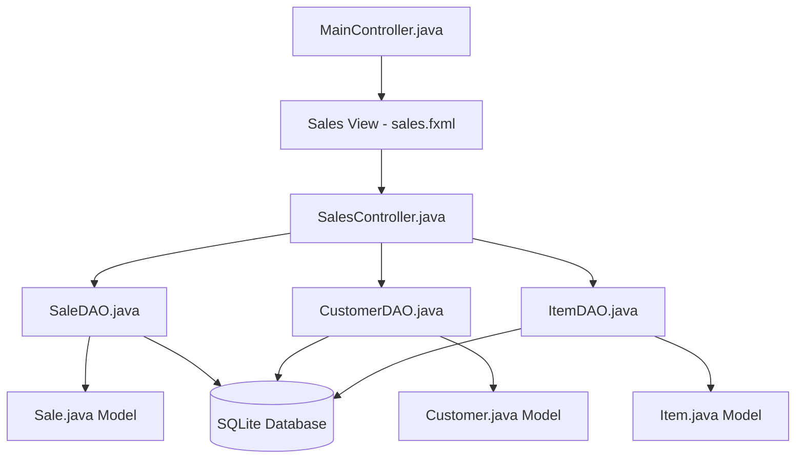

### Data Flow Architecture
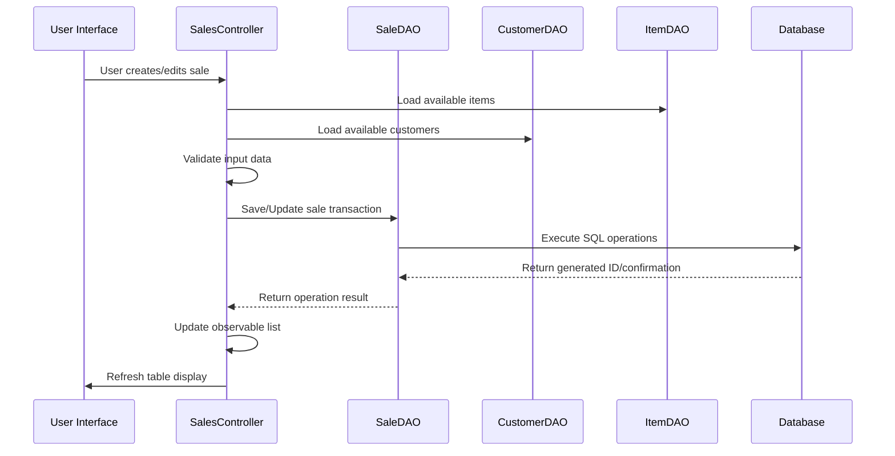

## UI Implementation

### Sales Management Interface Layout

The sales module UI will mirror the purchasing module structure with sales-specific adaptations:

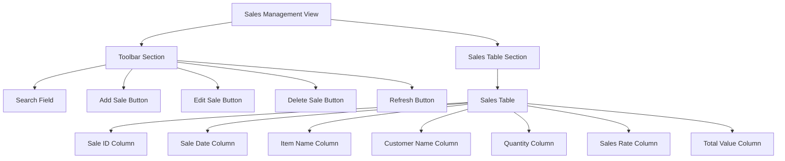

### Add/Edit Sale Dialog Structure

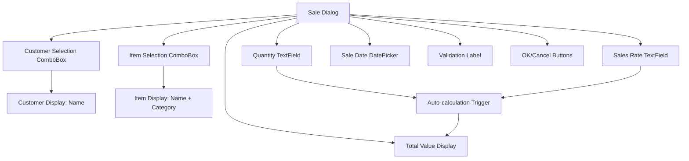

### Table Column Configuration
| Column | Property Binding | Cell Factory | Width |
|--------|-----------------|--------------|-------|
| Sale ID | `saleIdProperty()` | Default | 80px |
| Sale Date | `saleDateProperty()` | Date Formatter | 120px |
| Item Name | `itemNameProperty()` | Default | 180px |
| Customer Name | `customerNameProperty()` | Default | 150px |
| Quantity | `quantityProperty()` | Default | 80px |
| Sales Rate | `salesRateProperty()` | Currency Formatter | 100px |
| Total Value | `totalValueProperty()` | Currency Formatter | 120px |

## Controller Implementation

### SalesController Class Structure

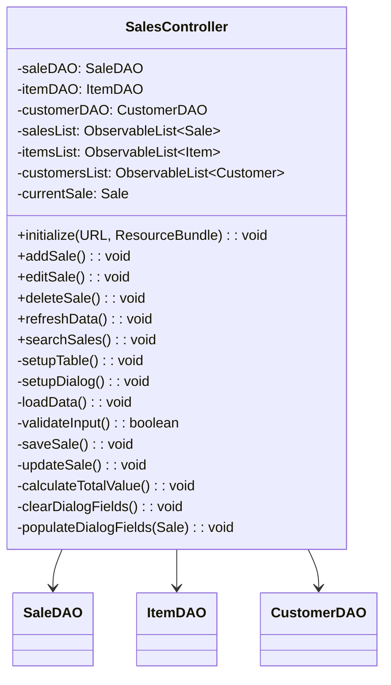

### Event Handling Architecture

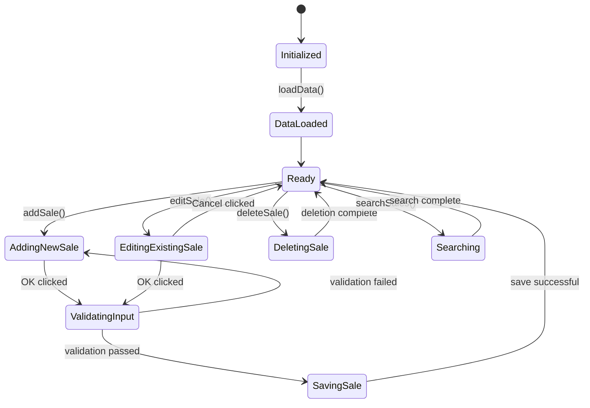

## Data Models Integration

### Sale Entity Enhancement
The existing Sale model already provides the necessary structure. Key properties include:

- **saleId**: Auto-generated primary key
- **itemId**: Foreign key to Items table
- **customerId**: Foreign key to Customers table  
- **quantity**: Number of units sold
- **salesRate**: Unit price charged
- **totalValue**: Calculated total (quantity × salesRate)
- **saleDate**: Transaction date
- **itemName/customerName**: Display properties for UI binding

### Automatic Calculation Logic
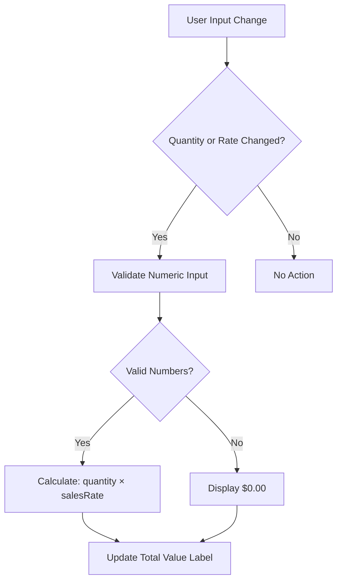

## Database Integration

### SaleDAO Operations
The existing SaleDAO provides complete CRUD operations:

- **insert(Sale)**: Creates new sale record with auto-generated ID
- **update(Sale)**: Updates existing sale record
- **delete(Integer)**: Removes sale record by ID
- **findAll()**: Retrieves all sales with customer/item names
- **searchSales(String)**: Searches sales by criteria

### Search Implementation Strategy
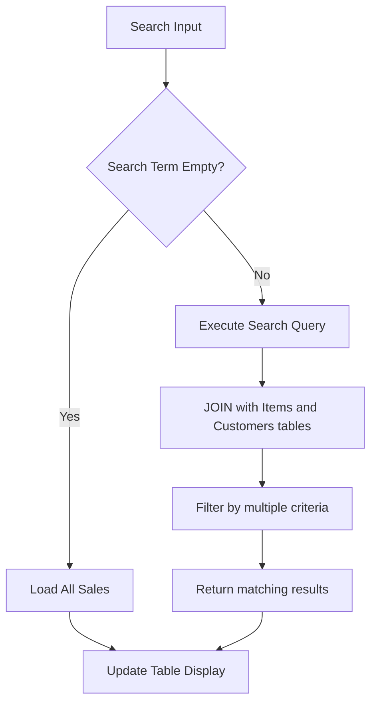

## Form Validation Rules

### Input Validation Matrix
| Field | Validation Rule | Error Message |
|-------|----------------|---------------|
| Customer | Must be selected | "Please select a customer" |
| Item | Must be selected | "Please select an item" |
| Quantity | Integer > 0 | "Quantity must be greater than 0" |
| Sales Rate | Decimal > 0 | "Sales rate must be greater than 0" |
| Sale Date | Must be selected | "Please select a sale date" |

### Real-time Validation Flow
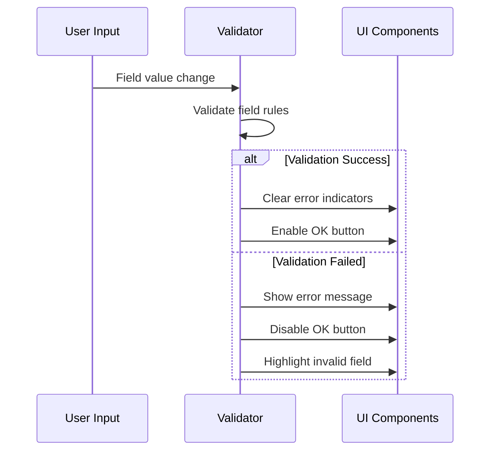

## User Interface Specifications

### ComboBox Configuration
#### Customer ComboBox
- **Display Format**: Customer name only
- **Prompt Text**: "Select customer"
- **Cell Factory**: Custom ListCell showing customer name
- **Selection Handling**: Automatic form validation trigger

#### Item ComboBox  
- **Display Format**: "Item Name (Category)"
- **Prompt Text**: "Select item"
- **Cell Factory**: Custom ListCell showing formatted item info
- **Selection Handling**: Auto-populate suggested sales rate if available

### Button State Management
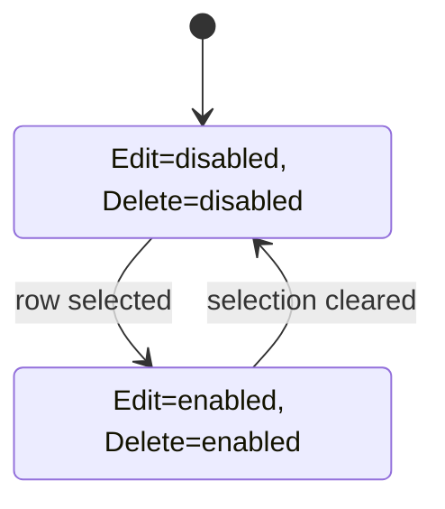

### Dialog Window Specifications
- **Title**: "Add New Sale" / "Edit Sale"  
- **Size**: Auto-resize based on content
- **Layout**: GridPane with consistent spacing (15px)
- **Padding**: 20px all sides
- **Theme Integration**: Inherits current application theme
- **Modal**: Blocks interaction with main window

## Error Handling Strategy

### Database Error Management
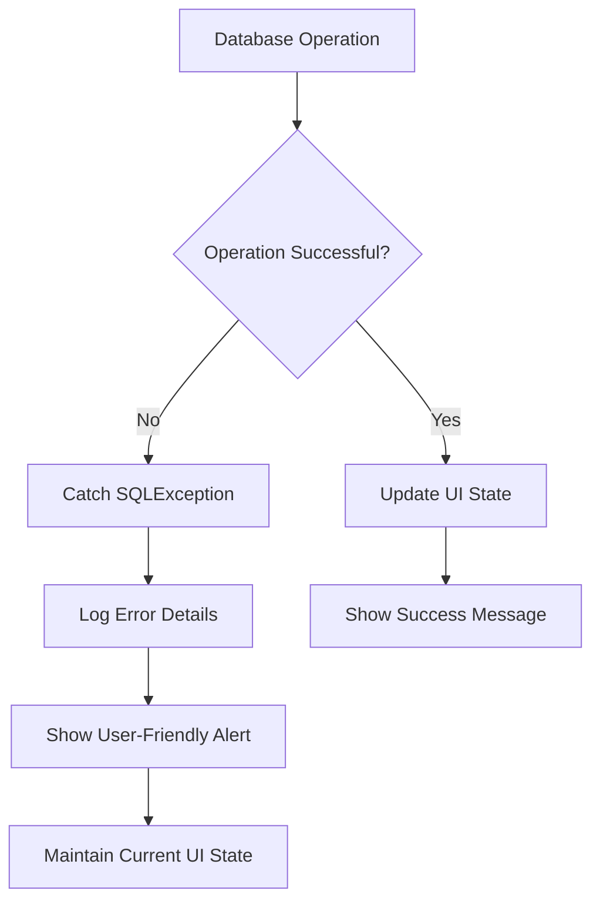

### User Input Error Handling
- **Real-time Validation**: Immediate feedback on field changes
- **Comprehensive Error Display**: Single validation label showing all errors
- **Field Highlighting**: Visual indication of invalid fields
- **Graceful Degradation**: Prevent form submission with invalid data

## Testing Strategy

### Unit Testing Requirements
- **Controller Methods**: Test all CRUD operations
- **Validation Logic**: Test all validation rules and edge cases  
- **Data Binding**: Verify proper model-view synchronization
- **Error Scenarios**: Test database connection failures and invalid inputs

### User Interface Testing
- **Form Interactions**: Test all button clicks and field inputs
- **Table Operations**: Verify sorting, selection, and display
- **Dialog Behavior**: Test modal operation and data persistence
- **Theme Compatibility**: Ensure proper styling in both light and dark themes

### Integration Testing Scenarios
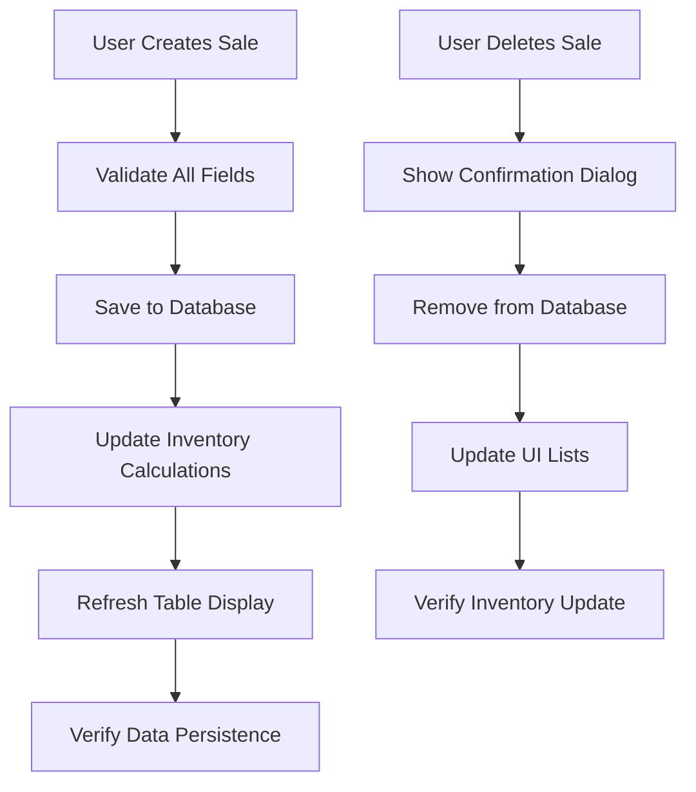