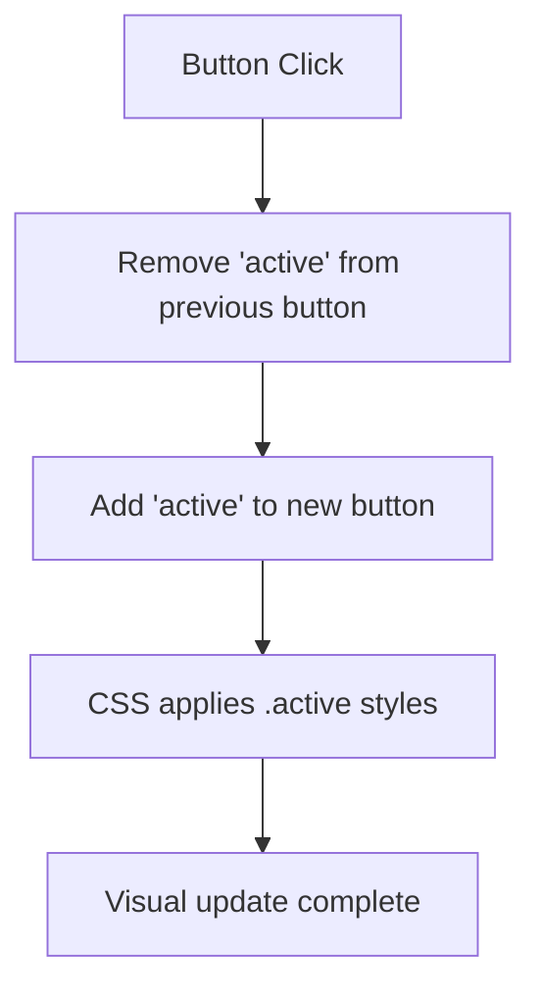
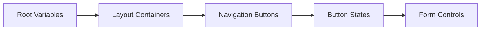

# Navigation Button Style Update Design

## Overview

This design document provides a comprehensive guide for updating navigation button styles in your JavaFX ERP system. The system currently uses CSS-based styling with both dark and light themes, and navigation buttons are implemented with specific style classes to ensure proper visual hierarchy and user experience.

## Current Implementation Analysis

### Navigation Button Structure
The navigation buttons in your ERP system are implemented using:
- **FXML Structure**: Buttons defined in `main-layout.fxml` with `styleClass="nav-button"`
- **CSS Styling**: Theme-specific styling in `theme-dark.css` and `theme-light.css`
- **Controller Management**: Active state management in `MainController.java` using `updateActiveButton()` method

### Current Style Classes
```
.sidebar .nav-button           // Base navigation button style
.sidebar .nav-button:hover     // Hover state
.sidebar .nav-button:pressed   // Pressed state
.sidebar .nav-button:focused   // Focused state
.sidebar .nav-button.active    // Active/selected state
```

## Style Update Issues and Solutions

### Common Style Update Problems

#### 1. CSS Specificity Conflicts
**Problem**: New styles not applying due to CSS specificity rules
**Solution**: Use enhanced selectors with higher specificity

#### 2. JavaFX CSS Cache
**Problem**: Styles cached and not refreshing immediately
**Solution**: Force style refresh or restart application

#### 3. Style Class Management
**Problem**: Dynamic style classes conflicting with CSS definitions
**Solution**: Proper style class addition/removal in controller

### Resolution Strategies

#### Strategy 1: Enhanced CSS Specificity
Use more specific selectors to ensure your new styles override existing ones:

```css
/* Instead of using generic .nav-button */
.sidebar .nav-button {
    /* Your new styles here */
}

/* For even higher specificity if needed */
.main-container .sidebar .nav-button {
    /* Your new styles here */
}
```

#### Strategy 2: Style Class Management
Ensure proper dynamic style class handling in the controller:



#### Strategy 3: CSS File Organization
Organize styles with clear hierarchy:



## Implementation Approach

### Step 1: Verify Current Style Structure

1. **Check CSS File Location**
   - Dark theme: `src/main/resources/css/theme-dark.css`
   - Light theme: `src/main/resources/css/theme-light.css`

2. **Verify Style Class Assignment**
   - FXML: `styleClass="nav-button"`
   - Controller: Dynamic `active` class management

### Step 2: Update CSS with Enhanced Specificity

#### Dark Theme Navigation Buttons
```css
/* Enhanced specificity for navigation buttons */
.sidebar .nav-button {
    -fx-background-color: transparent;
    -fx-text-fill: #7d8590;
    -fx-font-size: 15px;
    -fx-font-weight: 500;
    -fx-padding: 16 24;
    -fx-alignment: center-left;
    -fx-border-width: 0;
    -fx-cursor: hand;
    -fx-background-radius: 6;
    -fx-margin: 0 8 4 8;
}

.sidebar .nav-button:hover {
    -fx-background-color: rgba(46, 160, 67, 0.15);
    -fx-text-fill: #7ee787;
    -fx-background-radius: 6;
}

.sidebar .nav-button:pressed {
    -fx-background-color: rgba(88, 166, 255, 0.2);
    -fx-text-fill: #79c0ff;
    -fx-background-radius: 6;
}

.sidebar .nav-button.active {
    -fx-background-color: #0969da;
    -fx-text-fill: #ffffff;
    -fx-background-radius: 6;
    -fx-border-width: 0;
}
```

#### Light Theme Navigation Buttons
```css
.sidebar .nav-button {
    -fx-background-color: transparent;
    -fx-text-fill: #7c8b9a;
    -fx-font-size: 15px;
    -fx-font-weight: 500;
    -fx-padding: 16 24;
    -fx-alignment: center-left;
    -fx-border-width: 0;
    -fx-cursor: hand;
    -fx-background-radius: 6;
    -fx-margin: 0 8 4 8;
}

.sidebar .nav-button:hover {
    -fx-background-color: rgba(34, 134, 58, 0.1);
    -fx-text-fill: #1a7f37;
    -fx-background-radius: 6;
}

.sidebar .nav-button:pressed {
    -fx-background-color: rgba(9, 105, 218, 0.15);
    -fx-text-fill: #0550ae;
    -fx-background-radius: 6;
}

.sidebar .nav-button.active {
    -fx-background-color: #0969da;
    -fx-text-fill: #ffffff;
    -fx-background-radius: 6;
    -fx-border-width: 0;
}
```

### Step 3: Force Style Refresh

#### Method 1: Application Restart
- Rebuild and restart the application to clear CSS cache

#### Method 2: Programmatic Style Refresh
```java
// In MainController.java, add method to refresh styles
private void refreshStyles() {
    Scene scene = mainContainer.getScene();
    scene.getStylesheets().clear();
    MainApplication.applyTheme(MainApplication.isDarkTheme());
}
```

#### Method 3: Theme Toggle
- Use the existing theme toggle functionality to force style refresh

### Step 4: Validate Style Application

#### Visual Validation Checklist
| State | Expected Behavior | Dark Theme Color | Light Theme Color |
|-------|------------------|------------------|-------------------|
| Default | Subtle integration with sidebar | #7d8590 | #7c8b9a |
| Hover | Green accent feedback | #7ee787 | #1a7f37 |
| Pressed | Blue accent feedback | #79c0ff | #0550ae |
| Active | Clear blue selection | #ffffff on #0969da | #ffffff on #0969da |

## Troubleshooting Guide

### Issue: Styles Not Applying

#### Diagnosis Steps
1. **Check CSS Syntax**: Ensure proper JavaFX CSS syntax with `-fx-` prefixes
2. **Verify File Paths**: Confirm CSS files are in correct resource directory
3. **Inspect Specificity**: Use more specific selectors if needed
4. **Check Style Classes**: Verify FXML and controller style class assignments

#### Quick Fixes
1. **Clear Application Cache**: Restart IDE and rebuild project
2. **Use Important Declaration**: Add `!important` to CSS rules (use sparingly)
3. **Increase Specificity**: Add parent selectors for higher specificity
4. **Check Theme Loading**: Ensure correct theme file is being loaded

### Issue: Inconsistent State Management

#### Controller Validation
```java
// Ensure proper active state management
private void updateActiveButton(Button newActiveButton) {
    // Remove active class from all navigation buttons
    dashboardBtn.getStyleClass().remove("active");
    suppliersBtn.getStyleClass().remove("active");
    customersBtn.getStyleClass().remove("active");
    itemsBtn.getStyleClass().remove("active");
    purchasingBtn.getStyleClass().remove("active");
    salesBtn.getStyleClass().remove("active");
    inventoryBtn.getStyleClass().remove("active");
    financeBtn.getStyleClass().remove("active");
    
    // Add active class to new button
    newActiveButton.getStyleClass().add("active");
    activeButton = newActiveButton;
}
```

## Testing Strategy

### Unit Testing
1. **Style Class Application**: Verify correct style classes are applied
2. **Active State Management**: Test button state transitions
3. **Theme Switching**: Validate styles persist across theme changes

### Visual Testing
1. **Cross-Theme Consistency**: Test navigation in both dark and light themes
2. **State Transitions**: Verify smooth hover and press animations
3. **Accessibility**: Ensure proper contrast ratios and focus indicators

### Integration Testing
1. **Navigation Flow**: Test complete navigation workflow
2. **Style Persistence**: Verify styles maintain across view changes
3. **Performance**: Ensure style updates don't impact application performance

## Best Practices

### CSS Organization
- Keep navigation styles grouped together
- Use consistent naming conventions
- Document color choices and design rationale
- Maintain separation between themes

### Style Specificity Management
- Use minimal necessary specificity
- Avoid overly complex selectors
- Prefer class-based targeting over element targeting
- Document specificity reasoning

### Performance Considerations
- Minimize CSS rule complexity
- Use efficient selectors
- Avoid excessive DOM manipulation
- Cache style references when possible